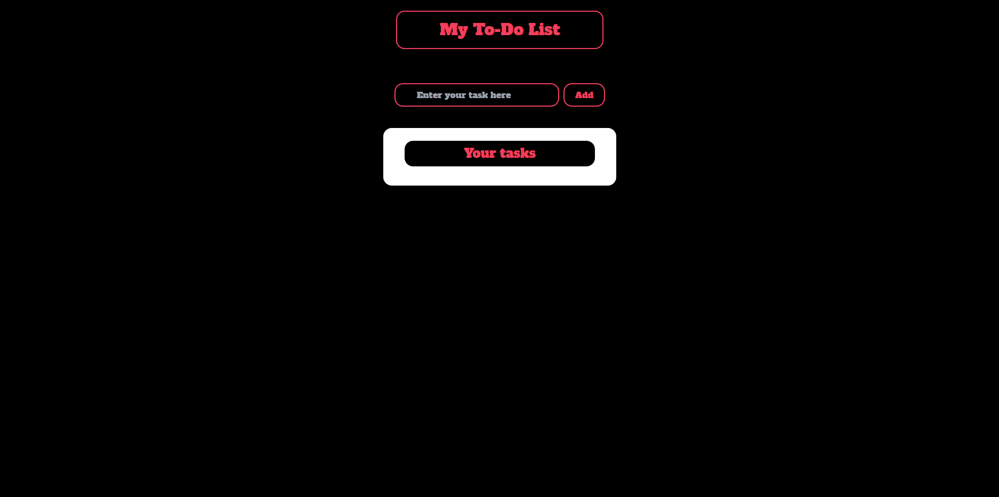

### To-Do List Vue 

## Sumário

- [Resumo](#Resumo)
  - [Desafio](#Desafio)
  - [Screenshot](#screenshot)
  - [Link](#link)
- [Processo](#Processo)
  - [Construido com](#construido-com)
  - [O que eu aprendi](#o-que-eu-aprendi)
- [Autor](#autor)

## Resumo

O desafio foi construir uma To-Do List utilizando Vue.js, TypeScript e Tailwind.


### Desafio

Foi a minha primeira vez desenvolvendo uma To-Do List, foi uma experiência pra lá de desafiadora. Meu objetivo era entender mais sobre o vue.js e suas funções, sintáxe e métodos próprios, criar interfaces com o typescript e utilizar pela primeira vez o framework css Tailwind para estilizar o projeto. 


### Screenshots

<p align="center"> Home</p>
  <div align="center"></img> </div>


### Link: https://list-vue-6aqf.vercel.app

## Processo

### Construido com

-Vue.JS <br>
-TypeScript <br>
-TailWind <br>
-HTML5 <br>
-CSS3 <br>
-JavaScript <br>

### Principais coisas que aprendi

Criar interface com TS

```js
export default interface ITarefa {
    descricao: string
}
```

Receber uma interface pelo vue

```js
    data() {
    return {
      tarefas: [] as ITarefa[]
    }
```

Instalar o Tailwind

```js
 /** @type {import('tailwindcss').Config} */
module.exports = {
  content: [".index.html", "./src/**/*.{vue,js,ts,jsx,tsx}"],
  theme: {
    extend: {},
  },
  plugins: [],
}

```

Importando fonte pelo TailWind
```js
    extend: {
      fontFamily: {
        'alfa': ['Alfa Slab One', 'cursive']
      }
    }
```
Utilizando dados na tela
```js
{{ tarefa.descricao }}
```
Utilizando v-bind
```js
v-bind:class="{ 'hide': !concluido }"
```

## Autor

-  Site pessoal - [Nicolas Gabriel](https://www.linkedin.com/in/nicolasgabriiel/)

<div  align="left">


